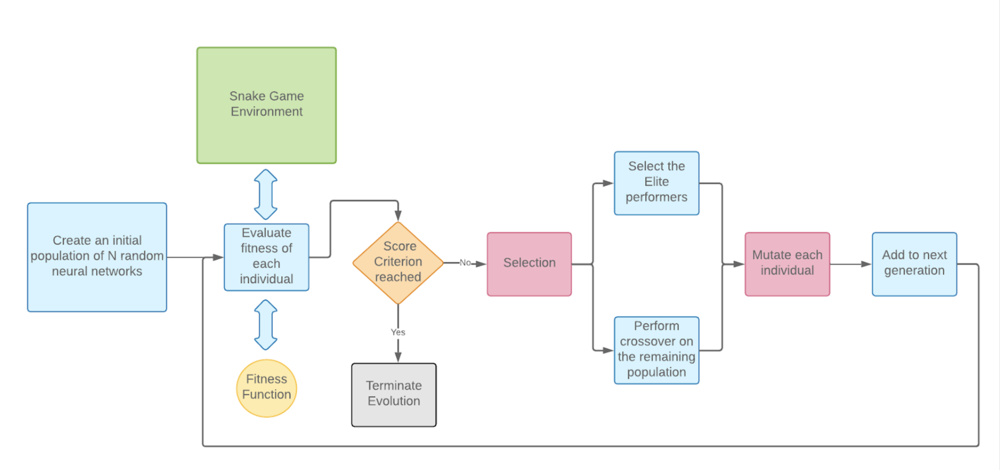
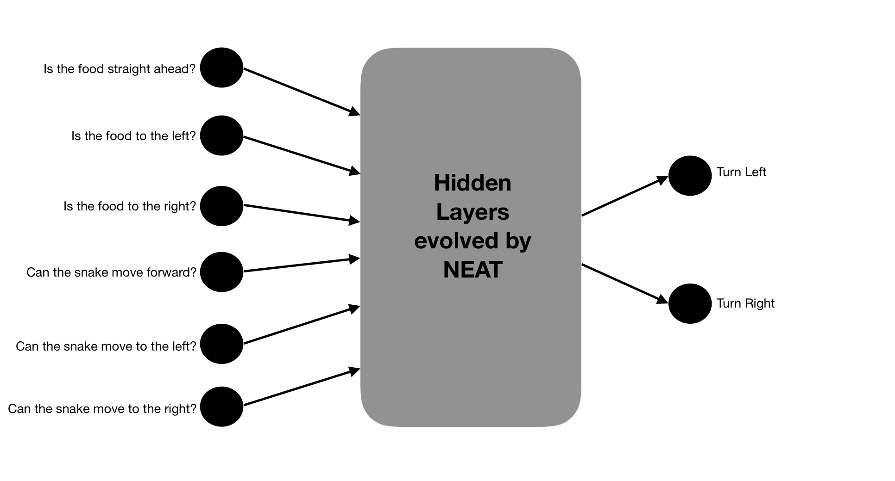
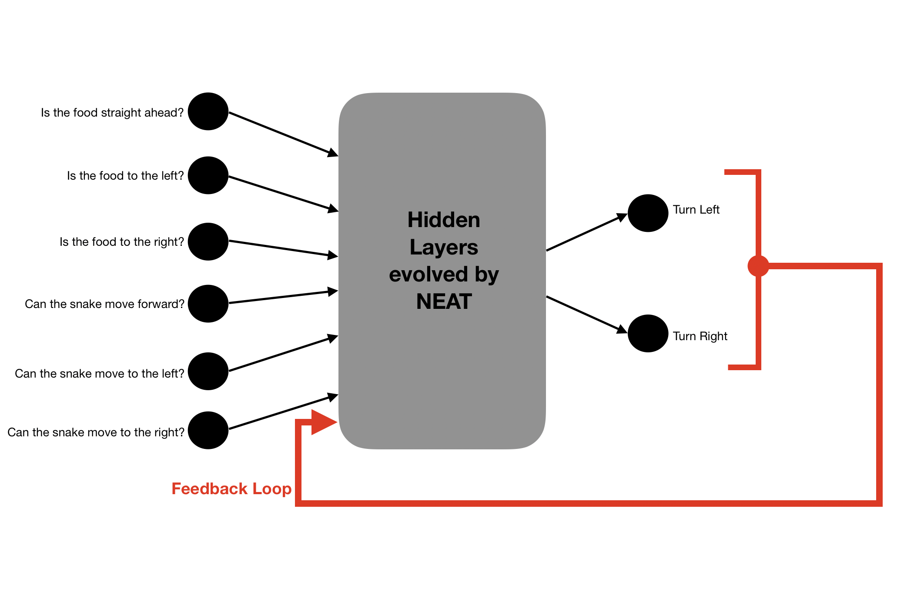
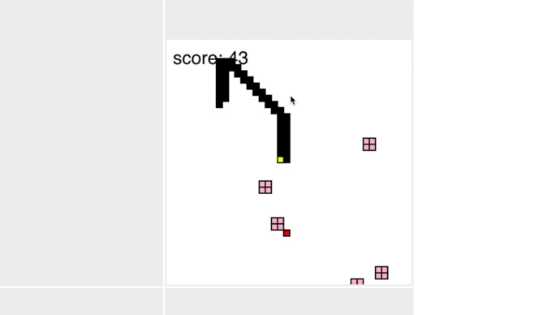

# A NEAT way to play Snake

This reposortory contains the source code which evolves a Neural Network to play and master the Snake game. This code runs on the browser, so it's really easy to set it up. The stack used is:

  - JavaScript
  - neataptic.js
  - p5.js
  - charts.js

# Approach
We use Neuroevolution to train a neural network to play the snake game. It combines Evolutionary Algorithms (Genetic Programming) with Deep Learning - in other words, it genetically evolves the most-suited and "fittest" Neural Network for a given task, in this case, to play the Snake game.

##### Why Neuroevolution?
 - NE does not need a dataset to train a Neural Network. It trains the network over mutiple simulations of the actual game, via mutations and cross-overs of the "fittest" individuals. 
 - NE finds use in domains where each move results in a different perception of the enviroment.
 - NE is very generic; the same algorithm can, with relatively few tweaks, be applied to a large number of different game-related tasks.
 - Games are excellent testbeds for neuroevolution research (and other AI research)
 - Other game playing algorithms (like A*) are tree-based search algorithms and are highly intensive.

We use **Neuroevolution of Augmenting Topologies (NEAT)** to evolve the most optimal and accurate neural network to master the Snake game.

[NEAT](http://nn.cs.utexas.edu/downloads/papers/stanley.ec02.pdf) is a special Neuroevolution algorithm which evolves Neural Networks from scratch, while generating children Neural Networks which are resemble their parents topologically, as well as geneticallly.

The overall, high-level idea is that we award positive points for every good move the snake makes (like eating the apple!) and we reduce some points when it makes a bad move (snake ate its own tail!). The fitenss function computes this score for each snake throughout its life time, based on which the evolution process happens. This now becomes a **Reinforcement Learning** problem.

# Architecutre
The following diagram sums up the flow of events which take place while the AI learns to play the game.

The main parts are:
- Snake Game Environement
- Selection 
- Crossover and Mutation
- Fitness function

The first step involves creating a population of randomized neural networks which will be subsequently be evolved for the task at hand. The fitness function evaluates each neural network against the Snake game environment by simulating a game with that corresponding neural network as that snake’s “brain”. Once the simulation of the current generation has completed, the top performing candidates (based on the scoring criteria defined) are deemed as “elites” and chosen to be a part of the next generation directly while 

The rest of the population are “crossover-ed” proportionate to their fitnesses, and then randomly mutated (to mimic real world evolution) thereby producing a new generation of children Neural Networks. This process repeats until we reach we reach a generation, where the offsprings (Neural Networks) have perfected themselves for the given task.

#### All points are multiplied by a scaling factor which depends on the length of the snake
    factor = max(1, 0.2 * snake_length)

There are no limits for the maximum number of turns a snake can make, however snakes which do not show progress (snakes which loop infinitely) over a period of time (400 steps) are killed.

---------------------------------------------------------------------------------
# Results

The results vary on a number of factors, like, scoring criteria, the chosen inputs for the Neural network, mutation rate, etc. A comprhenseive study of the results obtained when these various parameters are fine-tuned follows.

### Version 1
This version uses the below mentioned Inputs for all its subsequent sub-verisions.

*Inputs to the neural network*: 6
*Type of inputs*: Binary 
- Is the food straight ahead?
- Is the food to the left?
- Is the food to right?
- Can the snake move forward?
- Can the snake move to the left?
- Can the snake move to the right?

#### Version 1.1
**Scoring Criteria**
For each move the snake makes, it is given one or more of the following points.
- *Points for moving towards food:* 1
- *Points for moving away from food:* -1
- *Points for eating food:* 2
- *Points for staying alive:* 0

**Results at a glance**
- *Does it learn to avoid walls?:* Yes, 4th gen onwards
- *Does it learn to eat the food?:* Yes, 2nd gen onwards
- *Does it learn to not to eat itself?:* No
- *Target score of 200 acheived?:* No
- *High score:* 75, after 11 gens

**Details**
- Snakes learnt to move toward food very early, by the 2nd generation itself, probably owing to the negative reinforcement for moving against food.
- By the 4th generation, some snakes are able to get a decently good score of 60 food particles eaten, and avoiding walls swiflty.
- A high score of 75 was attained by a snake of the 11th gen.
- The next 20 generations were saturated and became stagnant with no improvement at all, and similar high scores and similar snake strategies. The snakes **always killed themselves** around the time when it's length reached 2 times the side of the board.
- Maybe the tradeoff isn’t good, between eating the food (2 points) and moving away from food. (-1 points)

**Intersesting moves learnt**
- Snake learns to grab the food at a very young stage.
-----------------------------------------------------------------------------
#### Version 1.2
**Scoring Criteria**
We reduced the negative reinforcment for moving against the food, hoping the snake can now learn not to kill itself in pursuit of food.
- *Points for moving towards food:* 1
- *Points for moving away from food:* -0.2
- *Points for eating food:* 2
- *Points for staying alive:* 0

**Results at a glance**
- *Does it learn to avoid walls?:* Yes, 4th gen onwards
- *Does it learn to eat the food?:* Yes, 4th gen onwards
- *Does it learn to not to eat itself?:* No
- *Target score of 200 acheived?:* No
- *High score:* 71, after 14 gens

**Details**
- Learnt to go after food after around 4 gens.
- By gen 10, they learn to properly avoid walls.
- High score of 71 acheived after around 14 generations
- Generations have stagnated after gen 10. In all subsequent generations, the snakes are pretty much the same. Same high scores, same patterns and techniques as in version 1.1
- Snakes have not yet learnt to not eat themselves (they can need only learn that when they are long enough). 
- Almost all snakes die by eating themselves. 

**Intersesting moves learnt**
- Snake tries to stick to the boundaries, to keep the centre of the playground empty, to facilitate food eating. 

---------------------------------------------------------------------------------

#### Version 1.3
**Scoring Criteria**
Maybe the tradeoff between losing points for moving away vs. points gained for eating the food still didn't make sense to the snake. We increase the points awarded for eating the food.
- *Points for moving towards food:* 1
- *Points for moving away from food:* -0.2
- *Points for eating food:* 10
- *Points for staying alive:* 0

**Results at a glance**
- *Does it learn to avoid walls?:* Yes, 3rd gen onwards
- *Does it learn to eat the food?:* Yes, 4th - 5th gen onwards
- *Does it learn to not to eat itself?:* No
- *Target score of 200 acheived?:* No
- *High score:* 89, after 18 gens

**Details**
- The snake performs a interesting “fast zig zag” to virtually reduce its size so that it minimises the chances of it running into itself. 
- But when it does run into itself, it still hasn’t learnt to turn away and ends up eating itself. 
- The generations are stagnated after around 20 gens

**Intersesting moves learnt**
- Snake performs fast zig zag moves to reduce its footprint
---------------------------------------------------------------------------------

#### Version 1.4
**Scoring Criteria**
Maybe awarding the snake points for every moment it is alive, will teach it the imporatance of staying alive (and not killing itself)
- *Points for moving towards food:* 1
- *Points for moving away from food:* -1
- *Points for eating food:* 2
- *Points for staying alive:* 0.01

**Results at a glance**
- *Does it learn to avoid walls?:* Yes, 3rd gen onwards
- *Does it learn to eat the food?:* Yes, 3rd gen onwards
- *Does it learn to not to eat itself?:* No
- *Target score of 200 acheived?:* No
- *High score:* 60, after 15-16 gens

**Details**
- As the snake is awarded points for making every valid move, to move from point A to point B, the snake chooses the longest path possible;  which happens to be a raping zig zag.
- This greedy strategy helps the snake to maximize its fitness score, however it does not learn not to eat itself.
- The generations are stagnated after 24 gens

**Intersesting moves learnt**
- Snake performs fast zig zag moves to increase its fitness score.
---------------------------------------------------------------------------------

#### Version 1.5
**Scoring Criteria**
Too many useless zig zag moves were made in the previous version. Maybe adding negative reinforcement will tell the snake to avoid unnecessary moves.
- *Points for moving towards food:* 1
- *Points for moving away from food:* -1
- *Points for eating food:* 2
- *Points for staying alive:* -0.01

**Results at a glance**
- *Does it learn to avoid walls?:* Yes, 3rd gen onwards
- *Does it learn to eat the food?:* Yes, 4th - 5th gen onwards
- *Does it learn to not to eat itself?:* No
- *Target score of 200 acheived?:* No
- *High score:* 43, after 12 gens

**Details**
- As expected, the snake makes very direct and shortest path moves to eat the food. The moves chosen are more “human” like, at least in the initial stages. 
- However, the snake takes this too seriously and often ends up eating itself, because the food was in that direction. 
- The logical decision would be to go around, but that would take more moves and cost it some points. Hence it chooses to continue to move directly at the food, eating itself and dying in the process. 
- Never gets past that; stagnates.

**Intersesting moves learnt**
- Snake strategises to minimise number of moves it makes.
--------------------------------------------------------------------------------

#### Version 1.6
**Scoring Criteria**
Teach the snake that it is not wrong to against the direction of the food.

- *Points for moving towards food:* 1
- *Points for moving away from food:* 0
- *Points for eating food:* 2
- *Points for staying alive:* 0

**Results at a glance**
- *Does it learn to avoid walls?:* Yes, 8th gen onwards
- *Does it learn to eat the food?:* Yes, 7th gen onwards
- *Does it learn to not to eat itself?:* Yes, 18th gen onwards
- *Target score of 200 acheived?:* No
- *High score:* 183, after 29 gens

**Details**
- Takes time to learn to go after food, 7 gens in.
- After 15 gens, snakes still eat themselves. 
- In gen 17 a snake learnt super complex moves, avoided eating itself on multiple times. A high score of 100 was achieved, and the quality of not eating itself is starting to carry over to children. 
- Snake learns really complex moves and starts thinking ahead in time - it is not greedy to grab the food at the earliest possible time. It rather “sets the stage” by performing a series of manoeuvres which makes it easier for the snake to eat the food AND avoid self trapping deaths. 
- By gen 21, it has learn the strategy of following its own tail to stay alive. 

**Intersesting moves learnt**
- Does not stick to wall, preferes to eat food in shortest distance if possible.
- Learnt how to avoid spiralling deaths after 20 gens.
- Learnt the strategy of following its own tail to stay alive.
---------------------------------------------------------------------------------

### Version 2
This version uses the below mentioned Inputs for all its subsequent sub-verisions. We added a new input to the neural network, which is a **feedback loop**. In other words, its previous output is one of its current inputs. Now the snake has the knowledge of the move it made last, left or right.

*Inputs to the neural network*: 7
*Type of inputs*: Binary 
- Is the food straight ahead?
- Is the food to the left?
- Is the food to right?
- Can the snake move forward?
- Can the snake move to the left?
- Can the snake move to the right?
- What was the last move the snake made?

#### Version 2.1
**Scoring Criteria**

- *Points for moving towards food:* 1
- *Points for moving away from food:* 0
- *Points for eating food:* 2
- *Points for staying alive:* 0

**Results at a glance**
- *Does it learn to avoid walls?:* Yes, 6rd gen onwards
- *Does it learn to eat the food?:* Yes, 8th gen onwards
- *Does it learn to not to eat itself?:* Yes, 21st gen onwards
- *Target score of 200 acheived?:* Yes, in 28 gens
- *High score:* 212, after 30 gens

**Details**
- The snake initially learns slowly, owing to an extra input.
- Over time, it picks up the basics - grab food, avoid walls, don't kill yourself
- After around 20 gens, the extra knowledge input started benefitting the snake
- It made movees accordingly, such that it does not trap iteslf. It made very intelligent moves, and it was thinking ahead in time.

**Intersesting moves learnt**
- Highly sentient moves
---------------------------------------------------------------------------------

# Taking it one step further
To increase the difficulty of this game, we now introduced **obstacles** which appear and dissappear at random times.

With the same configuration as in version 2.1, the snake learns how to avoid obstacles effectively. Learning is slower than usual, as expected.

--------------------------------------------------------------------------------

# Conculsion

Our study now comes to an end. We discovered that a NEAT stratgey to solve a game playing environemnt can be highly effective provided the inputs are definitive and the scoring criteria is well-formed. The concept can be extended to an **Automous Target Seeking Algorithm** which can be applied in a case such as when a robot has to navigate from point A to point B whilst avoiding obstacles by perceiving its environment in real-time.

